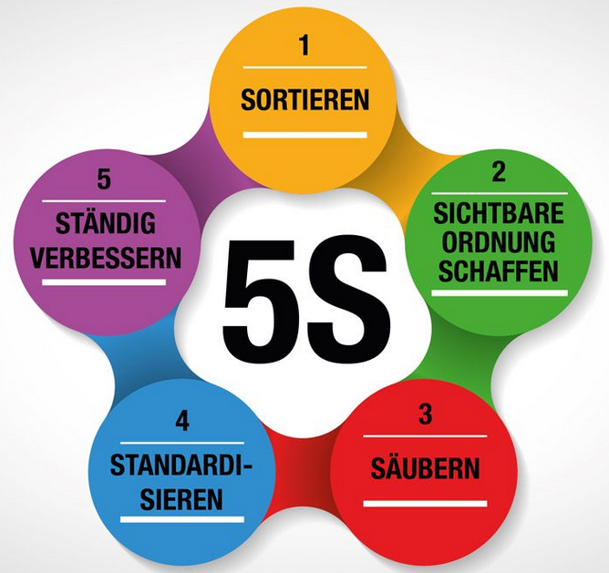

# Was ist Lean
- schlank
- Einfachheit / in kürzester Zeit
- Bedürfnisse der Kunden
- niedrigen Kosten
- Standardisierung
- effizienz
- höchstes Tempo
- aufs wesentliche reduziert / Verschwendung vermeiden
- unnötige arbeiten und ineffizient prozesse eliminieren

# Lean Management 
 Lean Management ist eine Unternehmensphilosophie! 

**Bei der es um eine hocheffiziente Arbeitsorganisation, die alles Überflüssige reduziert oder weglässt.**

**Sicht des Kunden**
- Erfüllung des Kundenwunsches
- Qualität
- Verfügbarkeit
- Preis

**Sicht des Unternehmens**
- profitabel
- Wettbewerbsfähigkeit
- schlanke Prozesse

# Lean Projekt management 
Lean-Projektmanagement ist die Anwendung der Lean-Prinzipien auf das Projektmanagement. 
Die zwei wesentlichen Schwerpunkte sind: 
- Mehrwert für den Kunden schaffen 
- Verschwendung minimieren.

Mögliche Methoden sind:
- 5s 
- 3Mu
- PDCA

**Kernprinzipien der 5S Methode**

**Beispiel Supportprozess Swisscom**
- Was sind die Anforderungen des Kunden bezüglich Support?
  - Support gemäss Kundenvereinbarung.
- Wie ist der Supportprozess heute, wie soll dieser in Zukunft aussehen?
  - Eingangskanäle reduziert (Postfächer).
- Massnahmen definieren, um den Soll Zustand zu erreichen
  - Eingangkanäle reduzieren
- Einzelen Steps auf Kunden ausgerichtet
  - Automatisierung 
- KVP
  - Team Regeln für Postfach handling
  - Unnötige Emails reduziert
  - Aufgaben automatisiert
  - Dokumentation intern aufgebaut
  - Templates erstellt

1. Seiri -Sortieren:  
*Nutzen aus Sicht des Kunden. Bedürfnisse exakt auf Kunde abstimmen um grösst möglichen Wert aus dessen Sicht zu erreichen.*

2. Seiton - Sichtbare Ordnung schaffen:  
*Die Wertstromanalyse beschreibt alle Aktivitäten, die zur Herstellung des Produkts oder der Dienstleistung erforderlich sind (ist / soll).*

3. Seiso - Säubern  
*Den gesamten Durchlauf optimieren,  nicht nur einzelne Abschnitte betrachten. Der Schwerpunkt liegt auf den Engpässen innerhalb des Gesamtablaufs.*

4. Seiketsu - Standartisierung  
*Der Kunden bestimmt den Takt unserer Arbeit, das entscheidende Kriterium ist der Kundenbedarf.*

5. Shitsuke - Ständig verbessern 
*Gedanke des kontinuierlichen Verbesserungsprozesses, da es immer wieder Formen der Verschwendung und Ansätze zur Verbesserung geben wird.*

# Beispiele

## Toyota

Ende der 40er setzte Toyota die Lean Methodik ein. Man hat auf JIT-Produktion (Just-In-Time Produktion). Statt grosse Lagerbestände wurde nur auf das notwendige beschränkt. 
Somit konnte man Verschwenung vermeiden und Effizienz steigern. Dank dieser Methode wurde Toyota zu einem der Effizientesten und erfolgreichsten Automobilhersteller der Welt.

### Verschwendung (Muda)

Sind alles Aktivitäten, die keinen Mehrwert haben und somit als Verschwendung gelten.

 ### Abweichung (Mura)

 Das sind unausgeglichene Verluste wodurch als Folge einige Ressourcen überlastet sind und andere unterlastet.

 ### Überlastung (Muri)

 Dies ist auch ein Verlust, weil alles Überbeanspruchung verlangt. Hier ist das Risiko dass man so unter viel mehr Druck steht.

 

## Microsoft

Die Lean-Methode stammt aus der Fertigung, wurde aber von David Anderson für die Softwareentwicklung angepasst, als er 2005 bei Microsoft arbeitete und ein leistungsschwaches Wartungsteam erbte. Softwareentwickler begannen, mit Lean zu experimentieren. Und heute ist es eine der am weitesten verbreiteten Methoden für das Management agiler Softwareentwicklungsprojekte.

Microsoft hatte 2013 die "One Microsoft" Initiative eingeführt mit dem Ziel, die Geschäftsbereiche zu verbesser und Effizienter werden. Diese Methode hat geholfen, dass Microsoft ein effizienteres und flexibles Unternehmen zu werden und dank dieser Methodik sind sie noch immer an der Spitze geblieben in der Technologiebranche.

## Swisscom
**Seit 10 Jahren setzt Swisscom auf die Lean Philosophie**

- Von 6 verschiedenen Ticketing System -> zu Einer Platform (ITSM) -> zu vereinfacht (Jira) 
- Abgleich Probleme (daily) Informations overload -> kleines Team
- Lean Master / Scrum Master  -> Prozess optimieren / Schnittstelle Auftraggeber -> Entwickler / unterstützung Team 
- ineffiziente Prozesse / Wartezeiten

# Lean Vorteile
- Effizienz
- Kosten 
- Qualität  
- Kundenzufriedenheit 
- Flexibilität
- Wettbewerbsvorteil

# Lean Nachteile
- Supply chain -Maske -Medikament -Automobilindustrie -Computerchips 
- Senkung des Lagerbestandes und des Personalaufwands kann zu Engpässen führen
- Weniger Spielraum durch optimierung
- Weniger Flexibilität
- Produktvielfalt
