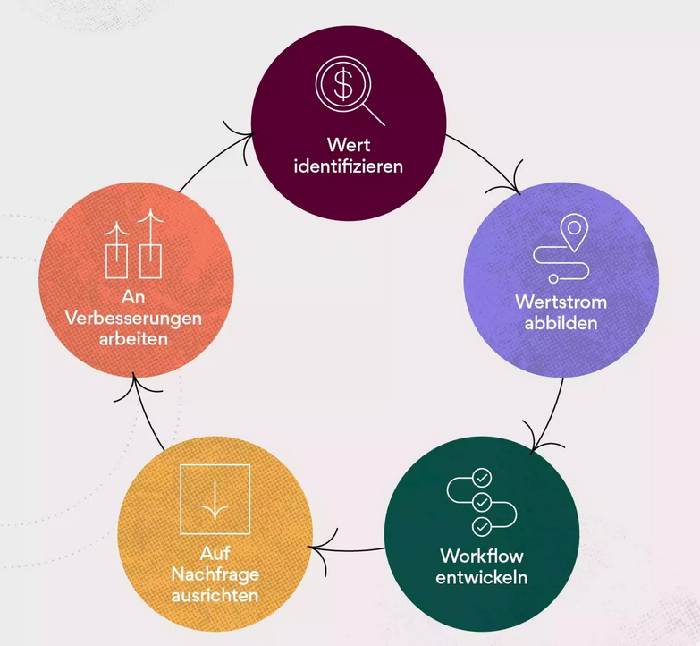

Uebersicht

# Was ist Lean : -> alle Stichworte
schlank
Zufriedenheit / Bedürfnisse der Kunden.
niedrigen Kosten.
«Einfachheit»
in kürzester Zeit
Standardisierung
Just-in-Time Logistik
effektiv
effizient
höchstem Tempo
Was lasse ich weg?
Was sind die wichtigsten Funktionen?

Lean-Projektmanagement Methode ist eine agile Methode, welcher sich auf die Maximale Wertschöpfung von Kunde konzentriert. Dabei wird berücksichtigt, dass die Verschwendung auf ein Minimum reduziert wird. Das Ziel ist es, die Ressourcen effektiver zu ausnützen und Mehrwert für den Kunden zu schaffen. Die Basis besteht aus Teamarbeit, kontinuierliche Verbesserung sowie Flexibilität. Es betont die Bedeutung von klaren Zielen, Verantwortlichkeiten und Regelmässiger Kommunikation.

# Lean Concept -> Dany 

# Lean Management -> Dany
 überflüssige Tätigkeiten (Verschwendung, japanisch „muda“) zu vermeiden

Sicht des Kunden
- Erfüllung des Kundenwunsches
- Qualität 
- Verfügbarkeit
- Preis
  
Sicht des Unternehmens
- profitabel 
- Wettbewerbsfähigkeit
- schlanke Prozesse 

# Lean Projekt management -> Roger
Lean-Projektmanagement ist Bestandteil der Agile-Methode, die durch das Eliminieren von unnötigen und überflüssigen Elementen bei der Projektarbeit zu einer Kundenwertsteigerung führt.

## Grundsätze des Lean-Projektmanagements

### Wert identifizieren
Im ersten Schritt des Lean-Projektmanagement werden die Wertvorstellungen für das Produkt ermittelt. Klärung der Projektbeteiligten:

- interner Beteiligter (verfolgt die Produktentwicklung, bsonderes Interesse am Projekterfolg)
- externer Beteiligter (Kunde der das Pordukt / Dienstleistung erwirbt)

Ist geklärt für wen das Produkt / Dienstleistung erstellt wird, kann dies bestmöglich an die Zielgruppe angepasst / optimiert werden.

### Wertstrom abbilden
Mit der Wertstromübersicht wird der aktuelle Workflow dem idealen Worklow gegenübergestellt (Von der Projektinitiierung bis zum Projektschluss).
Druch den Vergleich können nicht optimierte Prozess in jeder Projekt-Phase identifiziert werden. 
Somit können nicht optimierte / ineffiziente Prozesse identifiziert und optimiert werden.

# Lean Mindset -> Roger

# Beispiele
## Microsoft -> Christian 

Ein Anwendungsbeispiel bei Microsoft war, dass sie die "One Microsoft" Initiative 2013 eingeführt haben. Das Ziel war es, Zusammenarbeit und Integration zwischen verschiedenen Geschäftsbereichen von Microsoft zu verbessern und Effizienz mit Innovationskraft zu steigern. Im Rahmen von dieser Initative wurde das Tradtionelle Managementmodell zugunsten von einem Flacheren, Teambasierten Ansatz aufgegeben. Die Prozesse und Verfahren sind vereinfacht worden, damit der Informationfluss erleichtert wird und die Entscheidungen schneller getroffen werden kann. Die Lean-Methodik hat Microsoft geholfen, ein agileres, flexiberes und effizienteres Unternehmen zu werden. Auch hat es geholfen, dass sie weiterhin bei der Spitze der Technoligiebranchen geblieben sind.

## Toyota -> Christian

Der Ursprung der „Lean-Philosophie“ liegt im Bereich Logistik- und Produktionsmanagement. Ende der 40er Jahre setzte Toyota die Lean Production ein, um Prozesse zu streichen, die keinen Wert für das Endprodukt haben. Die Umstellung war auf die JIT-Produktion umgestellt (Just-In-Time Produktion). Anstatt dass man grosse Lagerbestände hat und die Engpässe in der Produktion abfedert, werden die Materialien und Komponenten nur bei Notwendigkeit geliefert. Das reduziert die Lagerkosten und Verschwendung und hat eine höhere Produktions-Effizienz. Diese Methode mit der Lean-Projektmanagement Methode hat dank der andauernden Innovation und Effizienzsteigerung zu einer neuen Kultur geführt. Somit ist Toyota zu einem der Effizientesten und erfolgreichsten Automobilhersteller geworden auf der Welt.

## Swisscom -> Roger / Dany
Seit 10 Jahren setzt Swisscom auf die Lean Philosophie

Lean Master
- ineffiziente Prozesse 
- Abgleich Sitzungen
- Wartezeiten 
- Nur das nötigste Informiert
  

Erhebliche Veränderungen für die Mitarbeiter  nicht nur der Prozesse, sondern auch der Zuständigkeiten.
Kultur der kontinuierlichen Verbesserung
 Je komplexer & komplizierter unsere Abläufe, Systeme und Prozesse sind

 Why Lean? 
…weil wir Swisscom für uns als Mitarbeitende einfacher & effizienter machen wollen und gleichzeitig unnötige Kosten sparen.
…weil unsere Kunden die Services/Produkte von Swisscom verstehen und einfach nutzen wollen.

# Weitere well known Tools -> Wenn was gefunden wird.

Kaizen / KVP
Muda, Mura, Muri (Toyota 3M Modell)
Jidoka
Hoshin Kanri
Gemba

# Lean Vorteile -> Alle 
reduziert und die Belegschaft konzentriert sich auf solche Aktivitäten, die Wert schaffen
Mitarbeiter alleine auf die Wertschöpfung fokussieren

Christian: 
- Effizienz kann gesteigert werden
- Kosten werden Reduziert
- Qualität wird verbessert 
- Kundenzufriedenheit steigt
- Man ist Flexibler Unterwegs
- Wettbewerbsvorteil
- Die Mitarbeiter Beteiligen sich

# Lean Nachteile -> Alle 
Senkung des Lagerbestandes und des Personalaufwands kann zu Engpässen führen
Belastung und der Stress zunehmen,
zu großen Druck kommt, wenn keine Fehler mehr erlaubt sin
Verbesserung erfordert ständige Anpassungen

Christian (Potenzielle Nachteile / Risiken): 
- Schwere Implementage
- Kürzere Lieferzeiten
- Abbau von Personal
- Weniger Flexibilität
- Übermässiger Druck