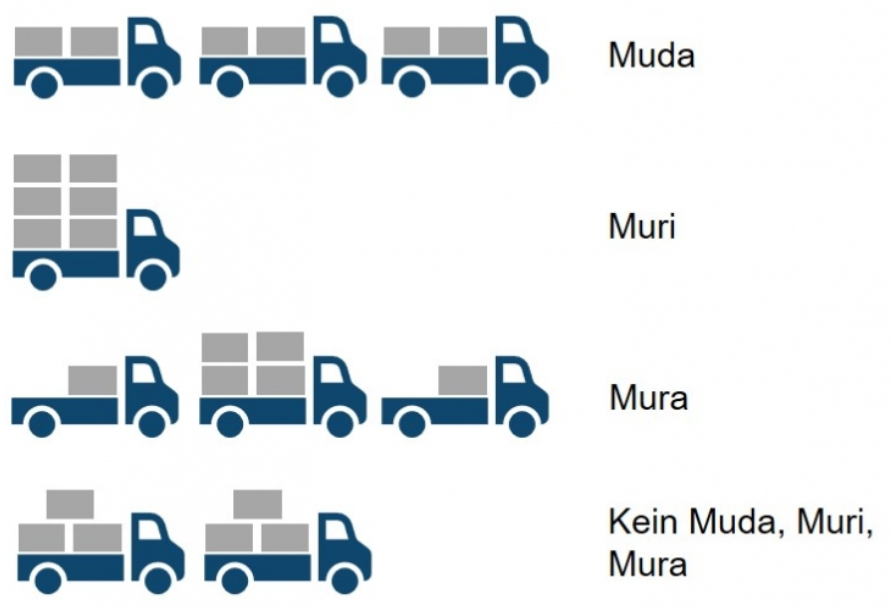

# Was ist Lean

- schlank
- Einfachheit / in kürzester Zeit
- Bedürfnisse der Kunden
- niedrigen Kosten
- Standardisierung
- effizienz
- höchstes Tempo
- aufs wesentliche reduziert / Verschwendung vermeiden
- unnötige arbeiten und ineffizient prozesse eliminieren

# Lean Management 
 Lean Management ist eine Unternehmensphilosophie! 
 
 Effektive und effiziente Gestaltung der Prozesse ohne Verschwenung, mit dem Kunden Bedürfniss im Mittelpunkt.

**Sicht des Kunden**
- Erfüllung des Kundenwunsches
- Qualität
- Verfügbarkeit
- Preis

**Sicht des Unternehmens**
- profitabel
- Wettbewerbsfähigkeit
- schlanke Prozesse

# Lean Projekt management 
Lean-Projektmanagement ist Bestandteil der Agile-Methode, die durch das Eliminieren von unnötigen und überflüssigen Elementen bei der Projektarbeit zu einer Kundenwertsteigerung führt.

**Grundsätze des Lean-Projektmanagements**

  !! Beispiel !! 

### Wert identifizieren

- interner Beteiligter (Unternehmen) / Externer Beteiligter (Kunde)
- Worklow entwickeln und auf Zielgruppe ausgerichted. -> Bedürfinss vom Kunde
- Auf Nachfrage ausrichten
- An Verbesserungen arbeiten
- Wiederholend 

### Wertstrom abbilden
Mit der Wertstromübersicht wird der aktuelle Workflow dem idealen Worklow gegenübergestellt (Von der Projektinitiierung bis zum Projektschluss).
Druch den Vergleich können nicht optimierte Prozess in jeder Projekt-Phase identifiziert werden. 
Somit können nicht optimierte / ineffiziente Prozesse identifiziert und optimiert werden.

# Beispiele

## Toyota

Ende der 40er setzte Toyota die Lean Methodik ein. Man hat auf JIT-Produktion (Just-In-Time Produktion). Statt grosse Lagerbestände wurde nur auf das notwendige beschränkt. 
Somit konnte man Verschwenung vermeiden und Effizienz steigern. Dank dieser Methode wurde Toyota zu einem der Effizientesten und erfolgreichsten Automobilhersteller der Welt.

### Verschwendung (Muda)

Sind alles Aktivitäten, die keinen Mehrwert haben und somit als Verschwendung gelten.

 ### Abweichung (Mura)

 Das sind unausgeglichene Verluste wodurch als Folge einige Ressourcen überlastet sind und andere unterlastet.

 ### Überlastung (Muri)

 Dies ist auch ein Verlust, weil alles Überbeanspruchung verlangt. Hier ist das Risiko dass man so unter viel mehr Druck steht.

 

## Microsoft

Die Lean-Methode stammt aus der Fertigung, wurde aber von David Anderson für die Softwareentwicklung angepasst, als er 2005 bei Microsoft arbeitete und ein leistungsschwaches Wartungsteam erbte. Softwareentwickler begannen, mit Lean zu experimentieren. Und heute ist es eine der am weitesten verbreiteten Methoden für das Management agiler Softwareentwicklungsprojekte.

Microsoft hatte 2013 die "One Microsoft" Initiative eingeführt mit dem Ziel, die Geschäftsbereiche zu verbesser und Effizienter werden. Diese Methode hat geholfen, dass Microsoft ein effizienteres und flexibles Unternehmen zu werden und dank dieser Methodik sind sie noch immer an der Spitze geblieben in der Technologiebranche.

## Swisscom
**Seit 10 Jahren setzt Swisscom auf die Lean Philosophie**

- Von 6 verschiedenen Ticketing System -> zu Einer Platform (ITSM) -> zu vereinfacht (Jira) 
- Abgleich Probleme (daily) Informations overload -> kleines Team
- Lean Master / Scrum Master  -> Prozess optimieren / Schnittstelle Auftraggeber -> Entwickler / unterstützung Team 
- ineffiziente Prozesse / Wartezeiten

# Lean Vorteile
- Effizienz
- Kosten 
- Qualität  
- Kundenzufriedenheit 
- Flexibilität
- Wettbewerbsvorteil

# Lean Nachteile
- Supply chain -Maske -Medikament -Automobilindustrie -Computerchips 
- Senkung des Lagerbestandes und des Personalaufwands kann zu Engpässen führen
- Weniger Spielraum durch optimierung
- Weniger Flexibilität
- Produktvielfalt